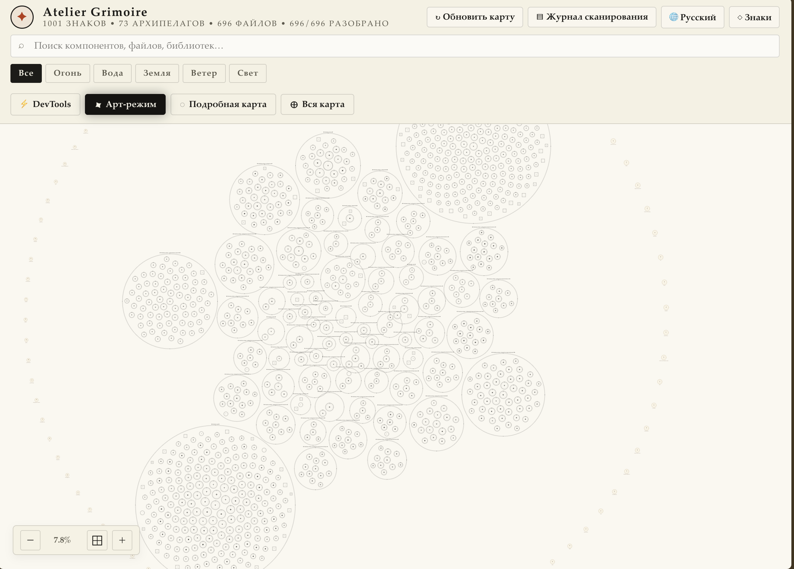
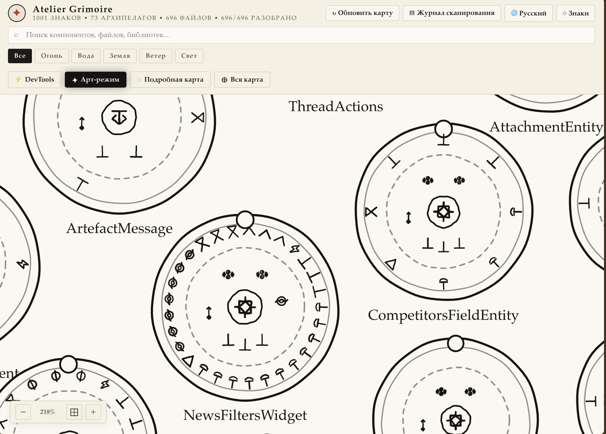
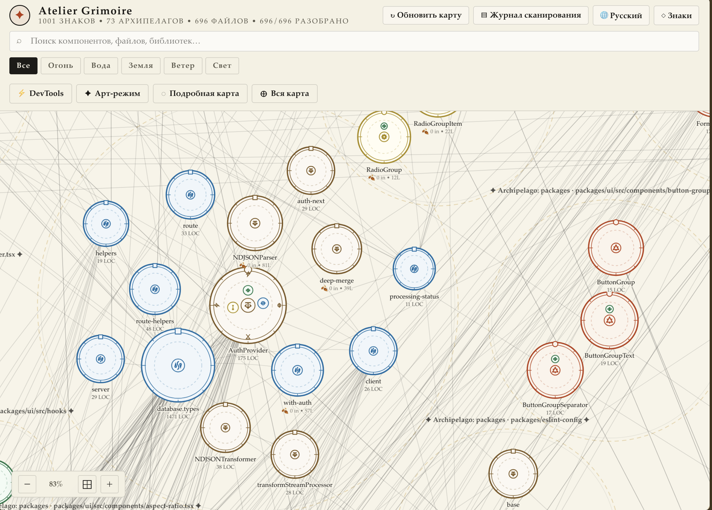
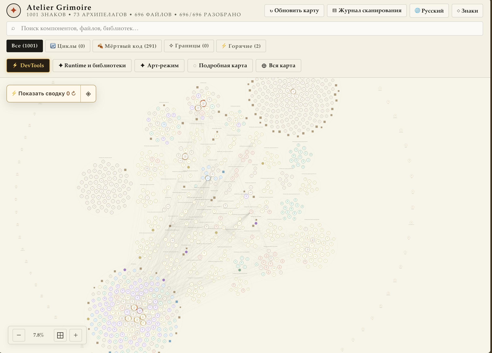
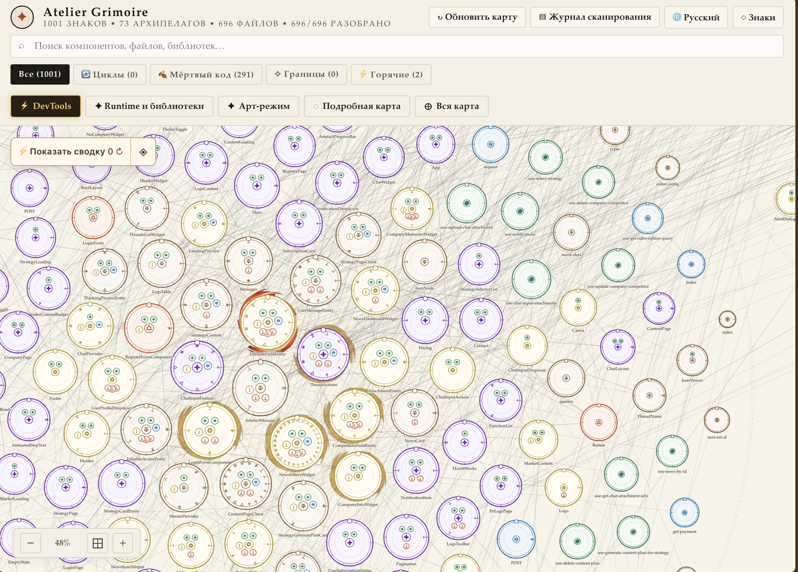
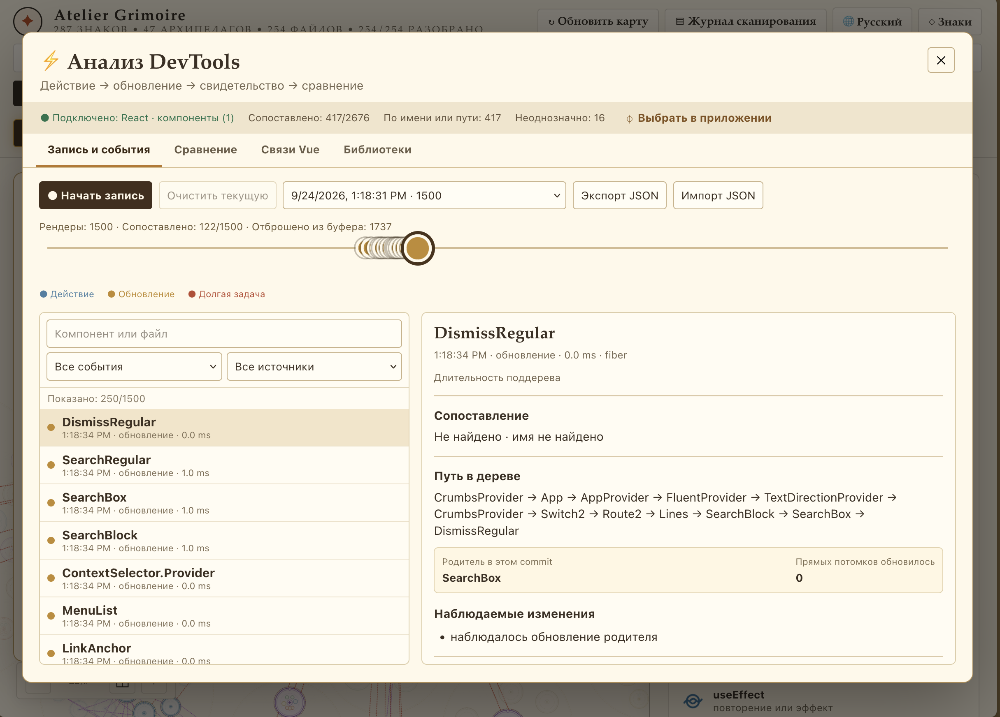
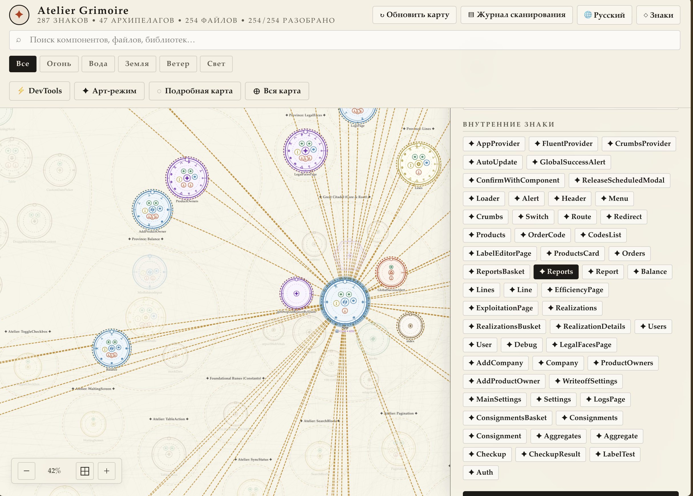

# Grimoire: примеры интерфейса

## Арт-режим: вся карта

**Вся карта** помещает проект на экран. Приближайте область колесом мыши или найдите компонент через поиск.

## Арт-режим: подробные печати

Знаки показывают найденные конструкции: например, три `useEffect` добавляют три знака на ободе. Внутренние знаки состояния и эффектов объединяют группы; у плотных печатей есть два кольца. Количество и список смотрите в инспекторе.

## Цветная карта

Цвета и символы помогают различать части проекта. Линии показывают связи, **LOC** — количество строк исходника.

## DevTools: обзор

Фильтры выделяют циклы, кандидатов в мёртвый код и другие находки. **Показать сводку** раскрывает счётчики.

## DevTools: подробная карта

Нажмите печать, чтобы открыть находки в инспекторе. Отключите **Подробную карту**, чтобы убрать мелкие знаки и анимации на слабом компьютере.

## DevTools: запись событий

Подключите приложение через **Runtime и библиотеки** и запустите `dev:grimoire`. Нажмите **Начать запись**, выполните действие и нажмите **Остановить и сохранить**. Выберите событие для просмотра длительности, дерева и изменений. **Не найдено** означает отсутствие сопоставления с печатью; **Отброшено из буфера** — неполную запись.

## Инспектор и дочерние компоненты

Нажмите печать: связи подсветятся, справа появится инспектор. Имена в разделе **Внутренние знаки** позволяют перейти к найденным дочерним печатям. Это состав компонента по исходнику, а не список текущих ререндеров.
